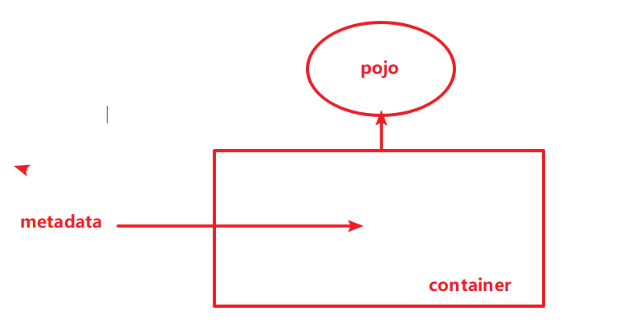
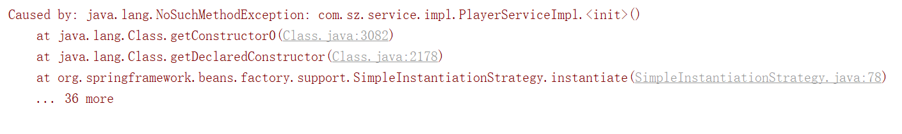
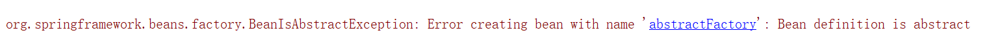
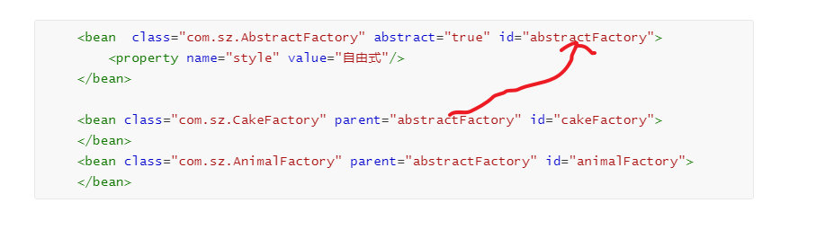
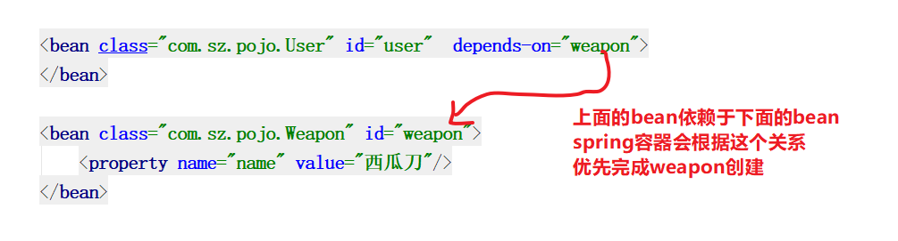
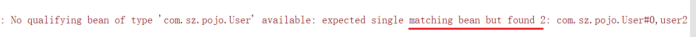
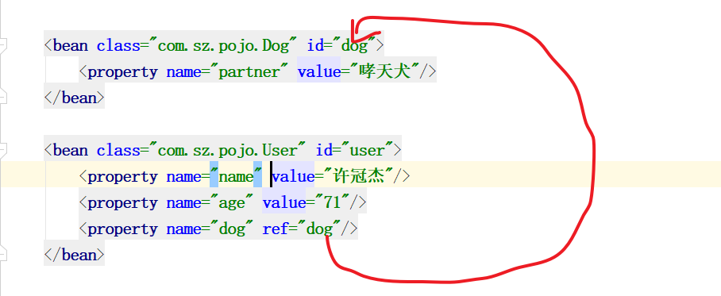

### IOC

> inversion of  control 控制反转
>


能否只依赖这个接口，尽量消除掉这个实现类的可见性。

当前这个接口的实例由我们的另外的第三方来提供。

如果设计完毕，那么我们使用者相当于对我们实现类是无感知的。

权力交接：权力交给我们spring  一个容器。


需要提供元数据给容器，容器使用元数据来创建实例，并且将这个实例提供给我们使用。开发人员只需要声明我们要什么，不再负责做什么。


### DI

依赖注入

DI属于IOC实现的一种方式

还有look up

### spring的快速入门

1 引入依赖

```xml
<dependency>
    <groupId>org.springframework</groupId>
    <artifactId>spring-context</artifactId>
    <version>5.1.8.RELEASE</version>
</dependency>
```

2 创建一个实例看看



元数据

- XML形式
- annotation（配合java  编码）

 这个就是spring的配置文件书写的地方，这个可以理解为是一个注册中心
    你在这里去告诉spring我要什么，然后spring的核心容器会来解析这个配置文件，
    根据元数据，去创建bean (一个个实例)
    主要应用技术是
        反射
            根据全限定类名，然后配合默认构造器来创建实例（如果没有必然报错）
            并注册到spring容器当中



上图表明我们的spring是它默认是依赖无参构造器来实现bean创建


#### 先使用球员方案

```java
package com.sz;

import com.sz.service.UserService;
import org.junit.Test;
import org.springframework.context.ApplicationContext;
import org.springframework.context.support.ClassPathXmlApplicationContext;

/**
 * @author 邱道长
 * 2019/07/25
 */
public class TestSpringStyle {

    @Test
    public void m1(){
        // 1 读取配置文件
        // 类路径下可以使用XML形式 的实现类
        ApplicationContext ctx = new ClassPathXmlApplicationContext("app.xml");
        UserService userService = (UserService) ctx.getBean("userService");
        userService.show();
    }
}

```

```xml
  <bean class="com.sz.service.impl.PlayerServiceImpl" id="userService"/>
```

#### 替换为演员的方案

源码不需要修改，我们只需要修改一下元数据配置的地方

```xml
<bean class="com.sz.service.impl.ActorServiceImpl" id="userService"/>
```

### bean 属性

id:唯一，不要重复就可以

name:给bean 取个名字,给bean取多个名字。

```xml
    <bean class="com.sz.service.impl.ActorServiceImpl" id="userService" scope="prototype" name="us usb usc"/>
支持多种分隔符号 
	空格   ;   ,
```

scope指定bean范围

- singleton (缺省)默认,单例
- prototype（原型）

```xml
  <bean class="com.sz.service.impl.ActorServiceImpl" id="userService" scope="singleton"/>
```

```xml
 <bean class="com.sz.service.impl.ActorServiceImpl" id="userService" scope="prototype"/>
```

框架它用它的方式实现了非常多的设计模式。

abstract

> 这个是描述一个bean为抽象
>
> 其目的是给其它bean作为一个基础bean
>
> 如果我们尝试去获取这个抽象bean的话，会失败
>



```xml
    <bean  class="com.sz.AbstractFactory" abstract="true" id="abstractFactory">
        <property name="style" value="自由式"/>
    </bean>

    <bean class="com.sz.CakeFactory" parent="abstractFactory" id="cakeFactory">
    </bean>
    <bean class="com.sz.AnimalFactory" parent="abstractFactory" id="animalFactory">
    </bean>
```




### bean的生命周期控制

```xml
<bean class="com.sz.pojo.User" id="user" init-method="cry" destroy-method="saySomething">
</bean>
```

init-method 控制 初始化的一个方法，做准备工作

destroy-method 这个方法生效必须容器关闭才能体现

```java
ApplicationContext ctx = new ClassPathXmlApplicationContext("app.xml");
User user = (User) ctx.getBean("user");
// 容器关闭的时候才执行  生命周期里面销毁方法
ClassPathXmlApplicationContext c = (ClassPathXmlApplicationContext) ctx;
c.close();
```

### 依赖属性

```xml

<bean class="com.sz.pojo.User" id="user"  depends-on="weapon">
</bean>

<bean class="com.sz.pojo.Weapon" id="weapon">
    <property name="name" value="西瓜刀"/>
</bean>
```




### 获取bean方法

1. 通过获取名字， 这种需要强转
2. 通过传入Class，这种不需要强转，但是必须bean唯一才可以



如果这个bean不止一个就会出问题

3  结合1 2 优点

```java
User user = ctx.getBean("user2",User.class);
```


### 注入

- setter 注入 这种注入它依赖于setXXX的方法
- 构造注入

setter注入

```xml
<bean class="com.sz.pojo.User" id="user">
    <property name="name" value="冠东"/>
    <property name="age" value="42"/>
</bean>
```

构造注入

```xml
<bean class="com.sz.pojo.User" id="user">
    <constructor-arg name="name" value="冠西"/>
    <constructor-arg name="age" value="62"/>
</bean>

```

注意，必须要提供对应的构造器

```java
public User(String name, Integer age) {
    this.name = name;
    this.age = age;
}
```

- 使用name + value的方式来指定
- 使用index + value的 方式

```xml
<bean class="com.sz.pojo.User" id="user">
    <constructor-arg index="0" value="德华"/>
    <constructor-arg index="1" value="28"/>
</bean>
```

- type + value 这种方式

如果参数的个数相同，同类型的参数个数相同的构造器有多个，它竟然和构造器的位置有关系

```xml
<bean class="com.sz.pojo.User" id="user">
    <constructor-arg type="java.lang.String" value="学友"/>
    <constructor-arg type="java.lang.Integer" value="38"/>
</bean>
```

- type + value + index强化控制

```xml
<bean class="com.sz.pojo.User" id="user">
    <constructor-arg type="java.lang.String" index="1" value="学友"/>
    <constructor-arg type="java.lang.Integer" index="0" value="38"/>
</bean>
```

通过这种方式可以指定严格的构造器，而且不会和顺序有关系，也是可以的，比较麻烦。

- name + value +index

  这种方式也可以完整的控制

```xml

<bean class="com.sz.pojo.User" id="user">
    <constructor-arg name="name" index="0" value="黎明"/>
    <constructor-arg name="age" index="1" value="44"/>
</bean>

```


### 注入非字面值

使用ref来进行引用

```xml

<bean class="com.sz.pojo.User" id="user">
    <property name="name" value="许冠杰"/>
    <property name="age" value="71"/>
    <property name="dog" ref="dog"/>
</bean>
```



### 通过两个命名空间简化配置

p 命名空间的使用

```xml
<?xml version="1.0" encoding="UTF-8"?>
<beans xmlns="http://www.springframework.org/schema/beans"
       xmlns:xsi="http://www.w3.org/2001/XMLSchema-instance"
       xmlns:p="http://www.springframework.org/schema/p"
       xsi:schemaLocation="http://www.springframework.org/schema/beans http://www.springframework.org/schema/beans/spring-beans.xsd">
 
    
    <bean class="com.sz.pojo.Dog" id="dog" p:partner="哮天犬"/>
    <bean class="com.sz.pojo.User" id="user" p:name="sam" p:age="71" p:dog-ref="dog" />

</beans>
```

c命名空间的使用

```xml
<?xml version="1.0" encoding="UTF-8"?>
<beans xmlns="http://www.springframework.org/schema/beans"
       xmlns:xsi="http://www.w3.org/2001/XMLSchema-instance"
       xmlns:p="http://www.springframework.org/schema/p"
       xmlns:c="http://www.springframework.org/schema/c"
       xsi:schemaLocation="http://www.springframework.org/schema/beans http://www.springframework.org/schema/beans/spring-beans.xsd">

    <bean class="com.sz.pojo.Dog" id="dog" p:partner="哮天犬"/>
    <bean class="com.sz.pojo.User" c:_0="a"   c:_1="1"  id="user"/>
</beans>
```

### 泛集合类型数据注入

- 数组
- list
- set
- map
- properties

```xml
<?xml version="1.0" encoding="UTF-8"?>
<beans xmlns="http://www.springframework.org/schema/beans"
       xmlns:xsi="http://www.w3.org/2001/XMLSchema-instance"
       xmlns:p="http://www.springframework.org/schema/p"
       xmlns:c="http://www.springframework.org/schema/c"
       xsi:schemaLocation="http://www.springframework.org/schema/beans http://www.springframework.org/schema/beans/spring-beans.xsd">

<!-----------------------------数组-------------------------------->
    <bean class="com.sz.pojo.User" id="user">
        <property name="girls" >
            <array>
                <value>韩雪</value>
                <value>关晓彤</value>
                <value>林青霞</value>
                <value>温碧霞</value>
            </array>
        </property>
   <!-----------------------------list-------------------------------->
        <property name="dogs">
            <list>
<!--                内部bean  不需要名字，外部也无法引用-->
                <bean class="com.sz.pojo.Dog" p:partner="阿黄" p:skin="黄色"/>
                <bean class="com.sz.pojo.Dog" p:partner="阿贵" p:skin="金色"/>
            </list>
        </property>
    <!-----------------------------set-------------------------------->
        <property name="luckyNumbers">
            <set>
                <value>1</value>
                <value>3</value>
                <value>7</value>
            </set>
        </property>
<!-----------------------------map-------------------------------->
        <property name="superDogs">
            <map>
                <entry key="dog1" >
                    <bean class="com.sz.pojo.Dog" p:partner="阿绿" p:skin="绿色"/>
                </entry>
                <entry key="dog2" >
                    <bean class="com.sz.pojo.Dog" p:partner="阿紫" p:skin="紫色"/>
                </entry>
            </map>
        </property>
<!-----------------------------properties-------------------------------->
        <property name="properties">
            <props>
                <prop key="user">root</prop>
                <prop key="password">root</prop>
                <prop key="driver">com.mysql.jdbc.Driver</prop>
            </props>
        </property>
    </bean>
</beans>
```


